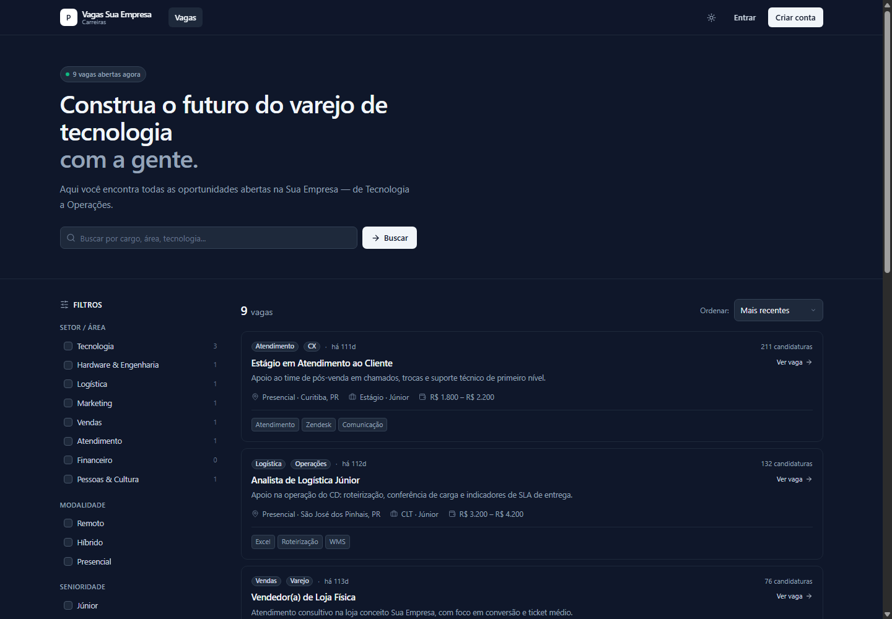
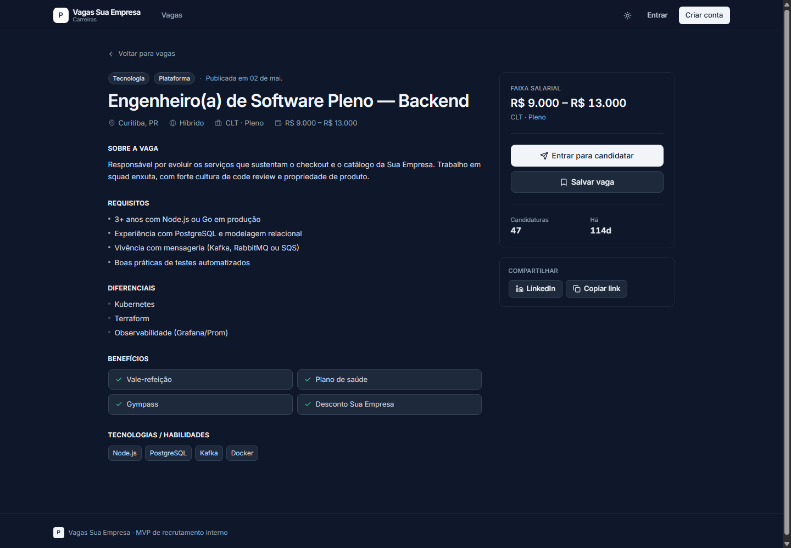

# Power Vagas

Plataforma de recrutamento da **Sua Empresa**. Permite que candidatos encontrem oportunidades e se candidatem, recrutadores gerenciem pipelines e administradores controlem acessos e taxonomias.

## Snapshots

### Lista pública de oportunidades



### Detalhes da oportunidade



---

## Tecnologias

| Camada | Tecnologia |
|--------|-----------|
| Frontend | React 18 + Vite 6 |
| Estilo | Tailwind CSS 3 |
| Ícones | Lucide React |
| Backend / Auth | Supabase (PostgreSQL + Auth) |
| Deploy | Vercel |

---

## Estrutura do projeto

```
power-vagas/
├── src/
│   ├── App.jsx                  # Roteador principal + gerenciamento de sessão
│   ├── main.jsx                 # Entrypoint React
│   ├── index.css                # Estilos globais (Tailwind)
│   ├── lib/
│   │   └── supabase.js          # Cliente Supabase (null se não configurado)
│   ├── services/
│   │   ├── auth.js              # Login, signup, logout, onAuthChange
│   │   ├── jobs.js              # CRUD de vagas
│   │   ├── applications.js      # Candidaturas e vagas salvas
│   │   ├── candidates.js        # Perfil de candidato
│   │   └── admin.js             # Recrutadores, setores, senioridade, contratos
│   ├── data/
│   │   └── mock.js              # Dados de demonstração (fallback sem Supabase)
│   ├── components/
│   │   ├── ui.jsx               # Primitivos: Button, Input, Modal, Badge, Card…
│   │   └── nav.jsx              # TopBar com navegação por papel (role)
│   └── pages/
│       ├── HomePage.jsx         # Listagem pública de vagas + filtros
│       ├── JobDetailPage.jsx    # Detalhe da vaga + modal de autenticação
│       ├── CandidatePage.jsx    # Painel do candidato (currículo, candidaturas)
│       ├── RecruiterPage.jsx    # Painel do recrutador (KPIs, kanban, analytics)
│       ├── TalentsPage.jsx      # Busca global de talentos
│       ├── AdminPage.jsx        # Painel administrativo
│       └── DiagramPage.jsx      # Diagrama ER + documentação da API
├── supabase/
│   ├── migrations/
│   │   └── 001_initial_schema.sql   # Schema completo com RLS
│   └── seed.sql                     # Dados iniciais para desenvolvimento local
├── .env.example                 # Variáveis de ambiente necessárias
├── vercel.json                  # Rewrite SPA para deploy na Vercel
├── tailwind.config.js
├── vite.config.js
└── package.json
```

---

## Papéis de usuário

| Papel | Acesso |
|-------|--------|
| **Candidato** | Visualiza vagas, se candidata, gerencia perfil e vagas salvas |
| **Recrutador** | Gerencia vagas, move candidatos no pipeline, busca talentos |
| **Admin** | Tudo do recrutador + gerencia recrutadores, setores, senioridade e contratos |

> Candidatos se cadastram diretamente em `/signup`. Recrutadores são criados **somente pelo admin** via painel administrativo.

---

## Instalação e execução local

### Pré-requisitos

- Node.js 18 ou superior
- npm 9 ou superior

### 1. Clone o repositório

```bash
git clone https://github.com/budswarez/Power-Vagas.git
cd Power-Vagas
```

### 2. Instale as dependências

```bash
npm install
```

### 3. Configure as variáveis de ambiente

```bash
cp .env.example .env.local
```

Abra `.env.local` e preencha com as credenciais do seu projeto Supabase:

```env
VITE_SUPABASE_URL=https://seu-projeto.supabase.co
VITE_SUPABASE_ANON_KEY=sua-chave-anon-aqui
```

> **Modo demonstração:** se você deixar `.env.local` vazio (ou não criá-lo), o sistema roda com dados mock e autenticação simulada — útil para testar sem configurar o Supabase.

### 4. Inicie o servidor de desenvolvimento

```bash
npm run dev
```

Acesse `http://localhost:5173`.

---

## Configuração do Supabase

### Pré-requisitos

- Conta em [supabase.com](https://supabase.com)
- [Supabase CLI](https://supabase.com/docs/guides/cli) instalado (opcional, para uso local)

### Opção A — Usando o Supabase CLI (recomendado)

```bash
# Instale o CLI (se ainda não tiver)
npm install -g supabase

# Faça login
supabase login

# Vincule ao seu projeto remoto
supabase link --project-ref SEU_PROJECT_REF

# Aplique o schema
supabase db push

# (Opcional) Aplique os dados de seed
supabase db reset
```

> `supabase db reset` aplica as migrations **e** o `seed.sql` — use apenas em ambiente de desenvolvimento.

### Opção B — Pelo painel do Supabase

1. Acesse seu projeto em [app.supabase.com](https://app.supabase.com)
2. Vá em **SQL Editor**
3. Cole e execute o conteúdo de `supabase/migrations/001_initial_schema.sql`
4. (Opcional) Execute também `supabase/seed.sql` para popular com dados de demonstração

### Obtendo as credenciais

1. No painel do Supabase, acesse **Settings → API**
2. Copie a **Project URL** → `VITE_SUPABASE_URL`
3. Copie a **anon / public key** → `VITE_SUPABASE_ANON_KEY`

> Nunca use a `service_role` key no frontend — ela ignora as políticas RLS.

---

## Contas de demonstração (modo mock)

Quando o Supabase **não** está configurado, qualquer senha funciona:

| E-mail | Papel |
|--------|-------|
| `admin@suaempresa.com.br` | Administrador |
| `renata.s@suaempresa.com.br` | Recrutador |
| `ana.lima@email.com` | Candidato |

Quando o Supabase **está** configurado e o seed foi aplicado, defina uma senha localmente pela API do Supabase. O seed não contém uma senha reutilizável.

---

## Deploy na Vercel

### 1. Conecte o repositório

1. Acesse [vercel.com](https://vercel.com) e clique em **Add New Project**
2. Importe o repositório do GitHub
3. Framework: **Vite** (detectado automaticamente)

### 2. Configure as variáveis de ambiente

No painel da Vercel, vá em **Settings → Environment Variables** e adicione:

| Nome | Valor | Ambientes |
|------|-------|-----------|
| `VITE_SUPABASE_URL` | URL do seu projeto | Production, Preview, Development |
| `VITE_SUPABASE_ANON_KEY` | Chave anon pública | Production, Preview, Development |

### 3. Deploy

Clique em **Deploy**. O arquivo `vercel.json` já garante que todas as rotas SPA funcionem corretamente.

---

## Scripts disponíveis

```bash
npm run dev       # Servidor de desenvolvimento (http://localhost:5173)
npm run build     # Build de produção (saída em /dist)
npm run preview   # Pré-visualiza o build de produção localmente
```

---

## Schema do banco de dados

```
auth.users           ← gerenciado pelo Supabase Auth
    │
    └── profiles          (id, role, name, email, avatar, phone, department, active)
            │
            └── candidate_profiles  (seniority, skills, availability, socials…)
                    ├── education
                    └── experiences

sectors              (id, label)
seniorities          (id, label, order)
contracts            (id, label)

jobs                 (title, sector_id, seniority, contract_id, salary_min/max, status…)
    │
    └── applications      (job_id, candidate_id, stage, note)

saved_jobs           (candidate_id, job_id)
audit_log            (actor_id, action, entity, meta)
```

### Segurança por papel (RLS)

| Recurso | Candidato | Recrutador | Admin |
|---------|-----------|-----------|-------|
| Vagas ativas | Leitura | Leitura + escrita | Total |
| Candidaturas | Próprias | Todas | Total |
| Perfis | Próprio | Leitura | Total |
| Setores / Contratos | Leitura | Leitura | Total |
| Recrutadores | — | — | Total |

---

## Modo demonstração vs. produção

O projeto tem dois modos de operação controlados pelas variáveis de ambiente:

**Modo mock (sem `.env.local`):**
- Autenticação simulada — qualquer senha funciona
- Dados estáticos de `src/data/mock.js`
- Ideal para desenvolvimento frontend sem backend

**Modo Supabase (com `.env.local` preenchido):**
- Autenticação real com e-mail e senha
- Dados persistidos no PostgreSQL
- RLS ativo por papel de usuário
- Candidatos recebem e-mail de confirmação ao se cadastrar
